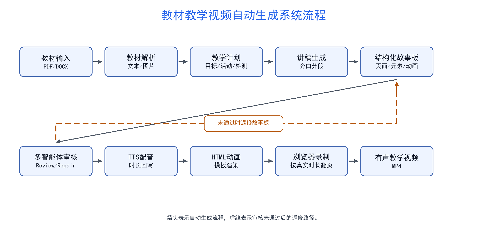
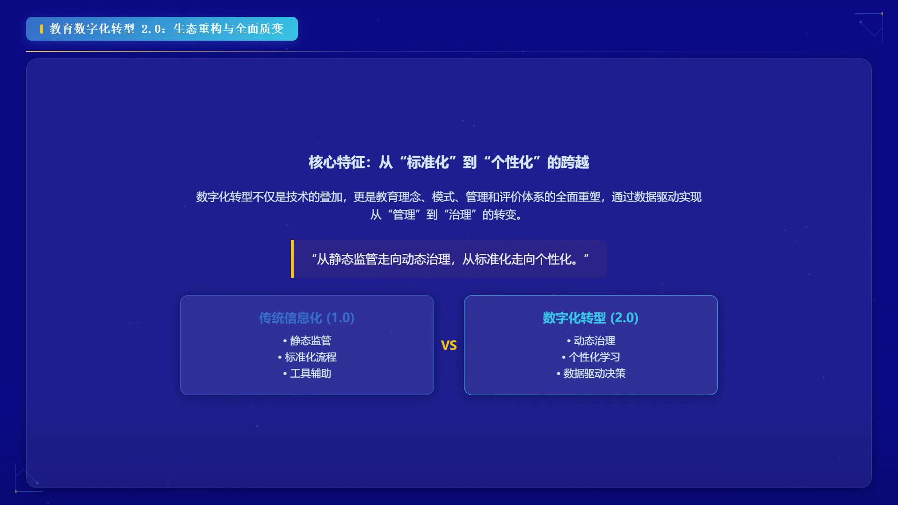

# 教材教学视频自动生成系统的设计与实现

作者名：________  
单位：________学院，________大学，________ 邮政编码：________

摘  要：针对教材章节难以快速转化为有声动画教学视频的问题，对教材教学视频自动生成方法进行了研究，设计并实现了一个面向PDF和DOCX教材的端到端生成系统。系统以教材章节文本和教材图片为输入，按照教材解析、教学计划生成、讲稿生成、结构化故事板（storyboard）生成、文本转语音配音、HTML动画渲染、浏览器录制和音画合成的流程生成MP4教学视频。方法上，在讲稿和画面生成之间引入教学计划层，用于组织教学目标、知识点、活动和检测题；采用结构化故事板描述每页画面的旁白、页面类型、元素列表和动画触发信息；在故事板生成后设置质量增强和多智能体审核环节，由生成智能体、审核智能体和修复智能体检查并处理标题复读、页面内容过少、图片引用异常、测验结构不完整和动画目标错误等问题；在动画生成阶段采用模板渲染优先、模型兜底的策略，将常见教学页面转换为可控HTML结构；在录制阶段依据文本转语音得到的真实音频时长控制页面切换，使画面进度与旁白分段保持一致。真实章节实验以“教育数字化转型”内容为对象，生成了包含11页画面、字幕和配音的教学视频，最终成片时长为261.1 s，同时输出HTML、故事板、字幕文件和质量报告等中间产物。实验结果表明，该系统能够完成从教材章节到有声教学视频的自动化生成，教学计划、结构化故事板、多智能体审核和时长驱动录制能够增强生成流程的可检查性和过程可控性。

关键词：教材视频生成；多智能体审核；模板渲染；教学设计；音画同步

文献标志码：A    中图分类号：TP391

# Design and Implementation of an Automatic Textbook Teaching Video Generation System

Author: ________

Abstract: A method for automatic textbook teaching video generation is studied, and an end-to-end system for PDF and DOCX textbooks is designed and implemented. The system takes textbook chapter text and textbook images as input and generates MP4 teaching videos through textbook parsing, lesson planning, script generation, structured storyboard generation, text-to-speech narration, HTML animation rendering, browser recording and audio-video composition. A lesson-plan layer is introduced between script generation and visual generation to organize learning objectives, knowledge points, activities and assessment questions. A structured storyboard is used to describe narration, page type, element lists and animation triggers for each slide. After storyboard generation, quality enhancement and a multi-agent review process are used to check and handle title-body repetition, sparse page content, abnormal image references, incomplete quiz structures and invalid animation targets. During animation generation, common teaching pages are converted into controllable HTML structures by template rendering, while model generation is used as a fallback. During recording, slide transitions are controlled according to measured text-to-speech durations, so the visual progress is aligned with narration segments. A real-chapter experiment on educational digital transformation generates an 11-slide teaching video with subtitles and narration. The final video lasts 261.1 seconds, and intermediate outputs include HTML, storyboard, subtitle files and a quality report. Experimental results show that the system can automatically generate narrated teaching videos from textbook chapters, and that lesson planning, structured storyboard representation, multi-agent review and duration-driven recording improve the inspectability and controllability of the generation process.

Key words: textbook video generation; multi-agent review; template rendering; instructional design; audio-video synchronization

教材内容向视频化教学资源转化是数字化教学中的常见需求。传统制作流程通常依赖教师或设计人员先阅读教材，再人工提炼知识点、撰写讲稿、制作课件、录制旁白并剪辑视频。该流程虽然能够保证较高的教学质量，但制作周期较长，不利于面向大量教材章节的快速生成。近年来，大语言模型和多模态生成技术推动了自动摘要、课件生成和演示视频生成的发展。PresentAgent能够将长文档转化为带旁白的演示视频，并强调视觉内容与语音内容的同步^[1]^；SlideTailor关注科学论文到幻灯片的个性化生成，使生成结果能够适配用户偏好和模板风格^[2]^。这些工作说明了自动演示内容生成的可行性，但面向教材教学场景时，仍需要处理教学活动组织、知识点检测、画面结构稳定性和音画同步等问题。

针对上述问题，设计并实现了一个教材教学视频自动生成系统。系统以教材文件为输入，以有声MPEG-4（MP4）教学视频为输出，重点解决三个问题：第一，如何把教材正文转化为面向教学的讲解结构，而不仅是文本摘要；第二，如何避免大语言模型生成的页面出现标题和正文重复、内容单薄、图片引用幻觉等问题；第三，如何使页面切换和元素动画尽量与真实旁白时长一致。围绕这些目标，系统引入教学计划层、结构化故事板、多智能体审核闭环和模板优先的超文本标记语言（hypertext markup language，HTML）动画渲染方法，并在真实章节上完成了系统演示。

## 1  系统总体架构

系统整体流程如图1所示。输入端支持可移植文档格式（portable document format，PDF）和Office Open XML文档（DOCX）格式教材。系统首先对教材进行解析，抽取章节文本和可用教材图片；随后调用大语言模型生成教学计划，明确本节课的教学目标、知识点、活动设计和检测题；在此基础上生成讲稿分段，并进一步转化为结构化故事板。每个故事板片段对应视频中的一页画面，包含旁白文本、页面类型、元素列表、动画信息和知识点绑定。之后，系统使用文本转语音（text-to-speech，TTS）模块生成每页旁白音频，并测量真实音频时长。动画生成模块将故事板渲染为单文件HTML，浏览器录制模块基于Playwright按页面时长录制无声视频^[3]^，最后由音视频合成模块基于FFmpeg将分段音频、字幕和画面合成为MP4成片^[4]^。

图1  系统总体架构  
Fig.1  Overall architecture of the system

系统主要模块包括教材解析、教学计划生成、讲稿生成、故事板生成、多智能体审核、动画渲染和录制合成。其中，教学计划和故事板是系统的两个关键中间层。教学计划负责确定“教什么”和“如何组织教学过程”，故事板负责确定“每一页画面如何呈现”。这种分层设计使后续质量检查、局部返修和人工审核更容易进行。

## 2  关键技术

### 2.1  教学计划与故事板表示

教材直接转讲稿容易退化为章节摘要，难以体现教学过程。为增强教学性，系统在讲稿和故事板之前增加教学计划层。该层记录教学目标、知识点、活动设计和检测题，使后续生成过程能够围绕教学结构展开。例如，在真实章节“教育数字化转型”的演示中，教学计划为系统提供了概念区分、数据赋能、教育科技要素、课堂活动和知识点检测等信息。后续故事板会根据这些信息生成“想一想”“知识点检测”“本节小结”等页面，从而使视频更接近教学设计，而不仅是教材摘要。

故事板是系统的核心中间表示。每页故事板包含`visual_type`、`narration`、`elements`和`animations`等字段。`elements`中可以包含标题、正文、图片、图标组、流程步骤、对比面板和测验卡片等结构化元素。与直接让模型生成HTML相比，结构化故事板更便于检查、修改和复用。

### 2.2  多智能体审核与质量增强

在真实测试中，模型直接生成的故事板曾出现标题与正文重复、页面内容过少、图片路径幻觉、动画目标与元素ID不一致等问题。为此，系统加入确定性质量增强步骤，自动删除标题复读内容，为内容偏薄页面补充正文或主视觉结构，并刷新动画目标，确保动画只指向真实存在的元素。

系统进一步设计了多智能体审核闭环。故事板生成智能体负责根据讲稿生成初始页面结构；审核智能体负责检查页面是否可以进入HTML渲染，重点关注标题复读、页面过空或过满、测验结构不完整、图片引用不合理和动画目标错误；当审核不通过时，修复智能体根据问题清单尝试返修故事板；返修后再交给审核智能体复审。审核意见、修复状态和最终通过情况会随故事板一并保存，便于后续检查生成过程。该闭环将模型生成与规则检查结合，减少了标题复读、页面过空、图片幻觉和动画目标错误等问题进入HTML渲染阶段的概率。

在实现中，系统没有完全依赖智能体进行底层修复，而是将确定性规则与智能体审核结合。例如，当修复智能体返回非法JSON时，系统不会直接中断非严格模式下的流水线，而是记录`repair_error`并保留当前故事板；当动画目标或timeline目标与元素ID不一致时，系统使用确定性规则进行修正。这种设计降低了模型输出不稳定对系统运行的影响。

### 2.3  模板渲染与HTML动画生成

动画生成阶段采用“模板渲染优先，模型兜底”的策略。对于定义、流程、对比、活动、测验和总结等常见教学页面，系统使用模板渲染器将结构化元素转化为稳定HTML。模板中预设了布局、字体、颜色、入场动画和响应式适配规则。对于模板暂不支持或需要更自由视觉表达的页面，系统再调用模型生成HTML片段。该策略兼顾了稳定性与表现力。

生成HTML后，系统会进行布局自检，包括多视口下的文字越界、内容重叠和安全区域检查。当发现部分页面存在越界风险时，系统可通过CSS hotfix进行修复。真实章节测试中，布局自检曾发现小屏下存在局部越界问题，系统自动进行了CSS修复后继续录制。

### 2.4  TTS时长驱动的录制同步

音画同步是教学视频生成中的关键问题。系统采用“音频先行”策略：先生成每页旁白音频并测量真实时长，再将`audio_duration_sec`写回故事板。随后，timing模块根据字幕切分和元素文本相似度，为每个动画元素生成`trigger_at_sec`。HTML中注入`slideDurations`和`slideTimelines`，分别控制页面时长和元素触发时间。

真实测试中曾出现旁白已经进入下一页而画面仍停留在上一页的现象。排查发现，HTML虽然包含真实`slideDurations`，但录制器没有按该数组进行自动翻页，而是退回到“总时长/页数”的均分翻页。由于真实页时长差异较大，均分翻页会造成音画错位。修复后，录制器优先读取`window.slideDurations`，按每页真实音频时长调用`SlideController.next()`，并提前500 ms触发转场，使下一页画面尽量对齐下一段旁白开始。

## 3  系统演示与结果分析

系统使用真实教材章节进行演示。演示章节主题为教育数字化转型，最终生成目录为`output\real_chapter_agent_review_test_v6_syncfix`。主要运行步骤包括：生成或复用真实章节讲稿；使用`--agent-review`生成并审核故事板；生成TTS音频并写入每页真实时长；渲染HTML动画；按真实页面时长录制无声视频；合成音频、字幕和画面，得到最终MP4。

图2  真实章节生成视频截图  
Fig.2  Screenshot of the generated teaching video

最终运行时，系统从已通过多智能体审核的`lesson13_storyboard.json`继续生成配音、HTML动画和MP4视频，输出目录为`output\real_chapter_agent_review_test_v6_syncfix`。

系统最终生成的主要产物见表1。

表1  真实章节输出结果  
Table 1  Outputs of the real-chapter experiment

| 产物 | 路径 | 说明 |
|---|---|---|
| MP4视频 | `lesson13.mp4` | 最终有声教学视频 |
| HTML动画 | `lesson13-pipeline-dark-blue-academic.html` | 可浏览器播放的动画页面 |
| 字幕 | `lesson13.srt` | 根据旁白生成的字幕 |
| 故事板 | `lesson13_storyboard.json` | 页面结构与旁白内容 |
| 质量报告 | `lesson13_quality.json` | 自动检查结果 |

该章节最终生成11页画面，包含导入页、概念讲解页、流程页、图示页、反思活动页、知识点检测页和小结页。多智能体审核结果为`passed`，审核摘要显示故事板结构完整，包含导入、核心知识点讲解、互动活动、知识检测及小结。最终MP4成片时长为261.1 s，与音频总时长一致。质量报告中仍出现`textbook image usage is low: 0/1`警告，原因是本次演示从已有script和故事板路径重跑，没有完整教材图清单，因此该警告不代表同步或视频生成失败。

与直接由大语言模型生成完整HTML相比，该系统更强调确定性控制。常见页面由模板渲染，模型主要承担讲稿、故事板和少量自由页面生成；页面质量由规则和智能体共同检查；录制阶段由真实TTS时长控制。这种设计降低了模型输出随机性对最终成片的影响，也便于在课程设计中展示系统流程、关键技术和运行结果。

## 4  结束语

设计并实现了一个教材教学视频自动生成系统，能够从教材内容出发，经过教学计划、讲稿、故事板、TTS、HTML动画和音视频合成等步骤生成有声教学视频。系统通过教学计划层提升内容组织的教学性，通过结构化故事板增强中间结果的可检查性，通过多智能体审核与确定性质量增强降低大语言模型输出不稳定性，通过模板渲染提高动画页面的布局稳定性，并通过真实音频时长驱动录制改善音画同步。真实章节演示表明，系统能够生成包含11页画面、字幕和配音的教学视频，最终成片时长为261.1 s。后续工作可进一步完善教材图片链路、优化页内动画节奏，并开发更易用的故事板表单化编辑界面。

参考文献：

[1] SHI J W, ZHANG Z Y, WU B, et al. PresentAgent: Multimodal agent for presentation video generation[C]//Proceedings of the 2025 Conference on Empirical Methods in Natural Language Processing: System Demonstrations. Stroudsburg: Association for Computational Linguistics, 2025: 760-773.

[2] ZENG W Z, OUYANG M Y, CUI L Y, et al. SlideTailor: Personalized presentation slide generation for scientific papers[EB/OL]. [2026-07-06]. https://arxiv.org/abs/2512.20292.

[3] Microsoft. Playwright documentation[EB/OL]. [2026-07-06]. https://playwright.dev/.

[4] FFmpeg Developers. FFmpeg documentation[EB/OL]. [2026-07-06]. https://ffmpeg.org/documentation.html.
